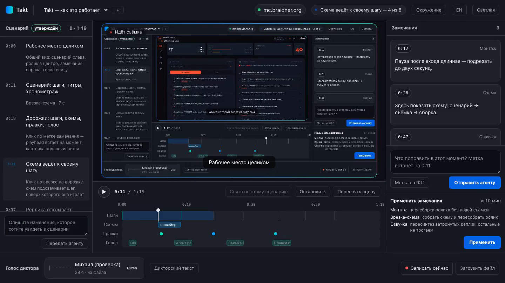

<div align="center">

# Takt

**A demo-video studio for web interfaces.**

Describe the story in plain words — an AI agent walks your UI in a browser,
records the screen, edits the cut, and narrates it with a cloned voice.
Feedback goes straight onto the timeline as markers.

[](LICENSE)
[](https://nodejs.org)
[](https://playwright.dev)
[](SKILL.md)

[Quick Start](#quick-start) · [How It Works](#how-it-works) · [As an Agent Skill](#as-an-agent-skill) · [FAQ](#where-things-live)



</div>

---

Takt is built for working in tandem with an AI agent (Claude Code and friends):
the agent scouts the interface and drafts the storyboard; you review, tweak, and approve.

## Why

Demo videos are usually made one of two ways, and both hurt. A screen recording with
live narration has to be reshot end-to-end because of a single slip of the tongue.
Editing in a video editor is a separate profession and days of work.

Here, **the video is a build artifact**. The storyboard, captions, diagrams, and narration
script live as data — so changing a phrase or a timestamp doesn't mean reshooting:
only what changed gets rebuilt. You reshoot only when what happens *on screen* changes.

## How It Works

| | |
|---|---|
| 🎭 **Playwright is the actor** | Drives the browser through the storyboard plans, capturing a full-page state per plan. Panning, push-ins and holds are then *composed* — each frame is computed from its number, so no frame can ever drop. Capture runs headless, so your machine stays free. |
| 🎬 **The studio is your workbench** | A local page: storyboard on the left, frame or finished video in the center, notes on the right, voices at the bottom. During capture, the center shows the live browser screen with per-step progress — you see what's happening and where it got stuck. |
| 📡 **The agent listens for events** | Studio and agent talk over long polling: the connection resolves exactly when you click, no periodic checks. Every request is visible in the UI ("pending" / "in progress"), and if no agent is attached, buttons lock so you never shout into the void. |
| 🗣️ **Narration via voice cloning** | Record a voice right in the browser or upload a file. The narration script is laid out across caption markers and checked for fit *before* synthesis: a line that doesn't fit its window would collide with the next one. |

## Requirements

- Node 20+ (everything else is installed by `takt start` on first run)
- `ffmpeg` with H.264 (`brew install ffmpeg`)
- Python — only for narration; installed via `takt install voice-qwen`

Voice synthesis works on every platform: MLX on Apple Silicon, PyTorch on Windows and
Linux (CUDA if you have an NVIDIA card; slow without one). It's the same model everywhere,
so a video started on one machine sounds identical on another.

Run `takt doctor` to see what's installed and what's missing; install the rest from the
**Environment** panel in the studio or with `takt install` (download size is shown up front).

## Quick Start

```bash
npx skills add Braidner/takt
```

Then, in Claude Code:

```
/takt start
```

That's it. On first run it installs what's missing (npm dependencies, the capture
browser), starts the studio in the background, opens http://localhost:4173, and the
agent attaches to studio events. Update anytime with `/takt update`.

Running without an agent? `node cli.mjs start` does the same from the terminal.
Optional capabilities — narration engines — are installed from the
**Environment** panel in the studio, each with its download size shown up front.

The target system's URL and credentials are entered **in the studio itself** — click the
stand chip in the header. The password stays on your machine: it never lands in the repo
and is never echoed back to the browser.

From there, everything happens in the studio: describe the video in words, adjust the
storyboard, hit **Shoot**.

## As an Agent Skill

Takt is designed to be operated by an agent. [`SKILL.md`](SKILL.md) at the repo root
describes the procedure: the agent starts the studio, attaches to the long poll, and works
event by event — draft the storyboard, shoot, edit, narrate, apply timeline notes. Details
for each event live in [`references/`](references/).

Install with `npx skills add Braidner/takt` — the CLI distributes the skill across agents
by itself (Claude Code, Codex, Cursor, and others). Manual route: symlink the directory
into `~/.claude/skills/takt`.

## Where Things Live

Three layers, and mixing them up is expensive:

| Layer | What it knows | Where |
|---|---|---|
| Code | how to shoot in general | this repository |
| **Target** | URL, login, sections, selectors, what not to touch | `$TAKT_HOME/targets/<slug>/` |
| Project | storyboard, states, video, notes, narration | `$TAKT_HOME/projects/<id>/` |

**A project is one video. A target is the system being filmed** — and one system can star
in many videos. Scouting an interface costs minutes, so its results live in the target:
the second video about the same system doesn't start with the same scouting. Next to the
machine-readable `target.json` sits `target.md` — the agent's prose notes about what won't
fit into a schema: what loads slowly, where the traps are, what must not be touched.

`$TAKT_HOME` defaults to `~/takt` and lives **outside the code on purpose**: the repository
gets updated and reinstalled, while recorded videos and voice samples must survive that.
Set a different path with the `TAKT_HOME` environment variable.

None of this ever enters the repository: it contains recordings of other people's
interfaces, voices of real humans, and credentials. Git history doesn't forget.

## System Preset (optional)

If you have several systems and want to describe them ahead of time instead of creating
targets from the studio — `studio/takt.preset.json`:

```json
{
  "name": "My system",
  "targets": { "local": "http://localhost:8080/" },
  "branchUrl": "https://{slug}.preview.example.com/app/",
  "ready": "#app, main"
}
```

`branchUrl` comes in handy when CI spins up an environment per branch: a fresh branch gives
you a clean system to film, and its URL is derived from the branch name. A target bound to
a specific video overrides the preset.

## Voice Cloning: the Legal Part

A person's voice is protected by law. You may synthesize someone's voice only with the
consent of its owner — the studio asks for confirmation when a voice is added and stores
it next to the recording. Consent must come from the voice's owner, not from whoever
brought the file.

## License

Code is [MIT](LICENSE). Synthesis engines: Qwen3-TTS (Apache 2.0) and Chatterbox (MIT),
both fine for commercial use; Chatterbox embeds a watermark.
